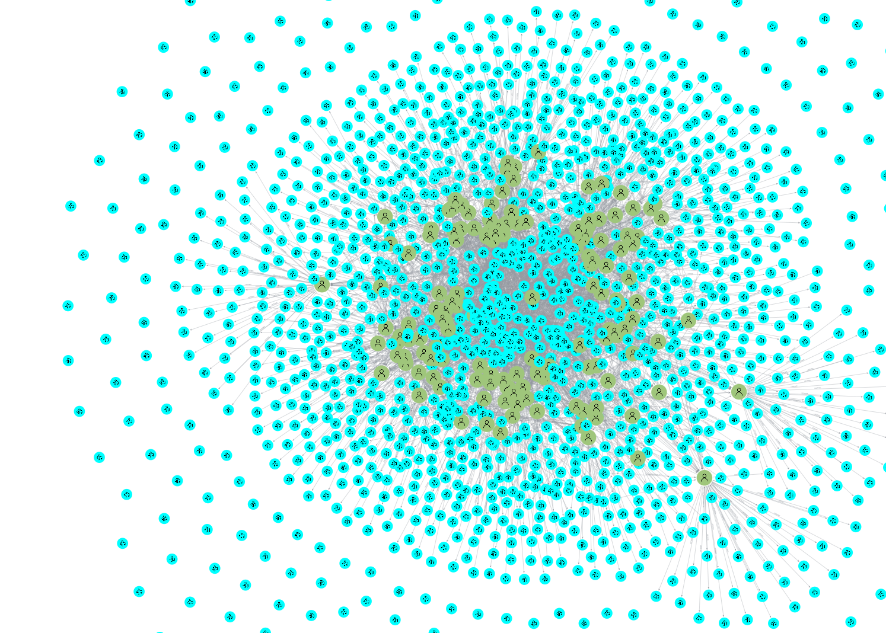

# 🎵 Music Recommendation System (Neo4j)
> **Project Goal:** Develop recommendation algorithms and intelligent graph queries to suggest music based on user listening history and preferences.

---

## 🛠 Project Overview
This lab project from **DIO** explores the power of **Neo4j Aura** and **Cypher** to connect users with their next favorite song. By leveraging graph relationships, we can go beyond simple metadata and look at the "behavioral connections" between users and the songs they listen.

### 🚀 Phase 1: Initial Setup
Created the first sketch of the graph database using Arrows.app, noticing it could be simplified and still provide many opportunities to recommend songs to a user.

Created the users nodes, with unique identificators on id property, creating constraints based on them. Also imported names randomly from a dataset to each user.
For the songs nodes, they were imported from a larger dataset, also with unique identificators and constraints based on id.
Both files containing the datasets in CSV are in the folder *materials*, along with many other files as documentation.

### 🧠 Phase 2: Recommendation Engine & Modeling Relationships
After creating the nodes, the relationships were creating in bulk, randomly assigning songs to each user, as '[:LISTENED]' relationships. However for the recommendation relationships, the queries were based on the songs already listened by the users, their favorite artists, genre, popularity of the songs to be recommended to minimise the risk of suggesting undesired songs. And since undesired songs were mentioned, the recommendations can also be filtered in whether it is explicit or not, so the recommendations can be as customised as possible.
Some of the recommendation queries are present in the following file:

[Recommendation Queries](<materials/neo4j_query_saved_cypher_2026-3-15 - Recommendation Queries.csv>)

### 📊 Phase 3: Visualizations & Results:
After testing, visualisations were created to show the final status of the project, and this can be seen in the images below:

#### Final Graph Diagram (Arrows.app)

#### Data Exploration (Neo4J Aura Bloom)

#### Database Schema (Neo4J Aura)
